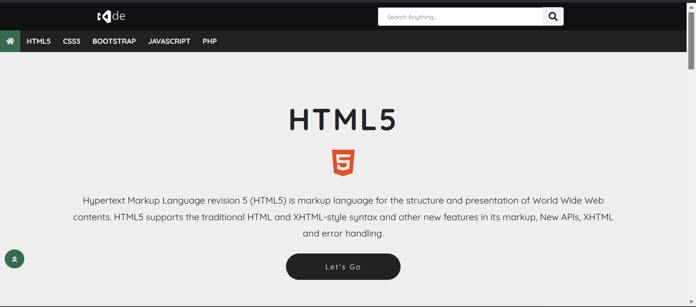
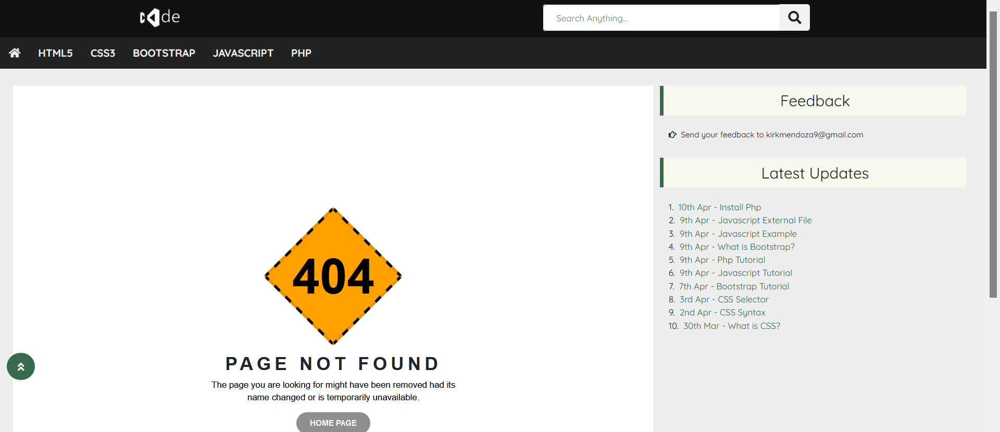

# Wordpress Theme

This is a simple Wordpress Theme to learn programming lesson in a nutshell

## Demo Picture Only


## Getting Started

These instructions will get you a copy of the project up and running on your local machine for development and testing purposes. See deployment for notes on how to deploy the project on a live system.

### Prerequisites

What things you need to install the system

```
PHP 5.3.7 and higher
MySQL 8.0
```

### Installing

A step by step series of examples that tell you how to get a development env running

Say what the step will be
```
Clone or download the repository.
```
and
```
Setup the database and create your login details
```

## Built With

* [PHP](https://codeigniter.com/) - Backend Language used
* [Jquery](https://jquery.com/) - JS library used
* [Bootstrap](https://Bootstrap.com/) - Css Framework used
* [Fontawesome](https://fontawesome.com/) - Icons use

## License

This project is licensed under the MIT License - see the [LICENSE.md](LICENSE.md) file for details

## Contact

Kirk Anthony Mendoza - [@RonCajan](https://twitter.com/RonCajan) - cajanr02@gmail.com

Project Link: [https://github.com/ronilcajan/PointOfSale](https://github.com/ronilcajan/PointOfSale)


## Acknowledgments

* Hat tip to anyone whose code was used
* Inspiration
* etc

