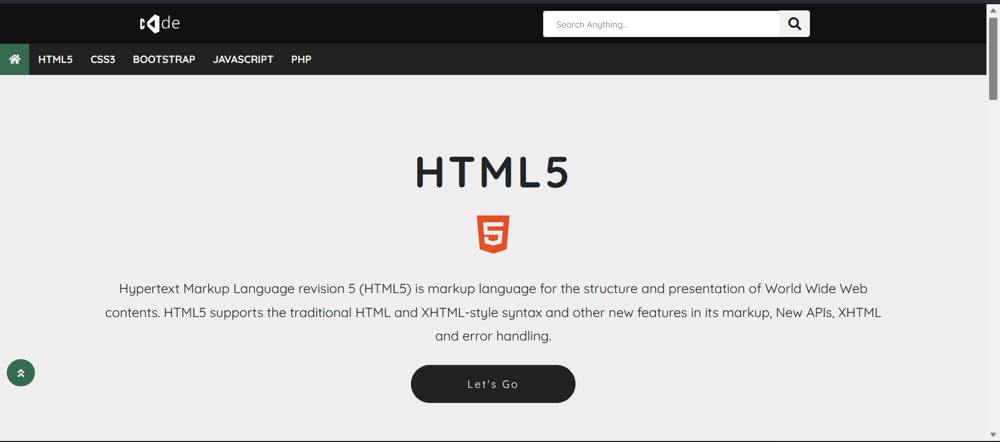
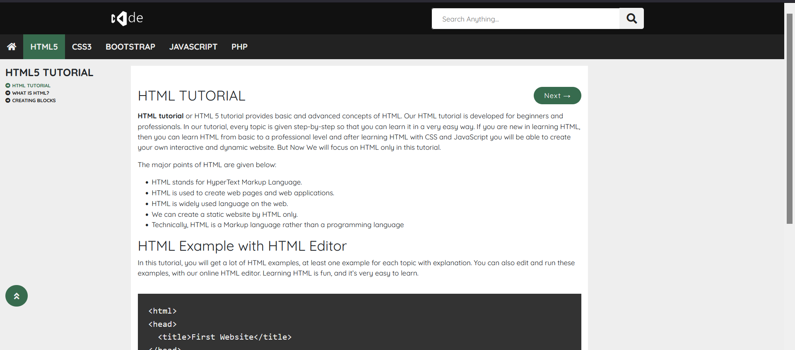
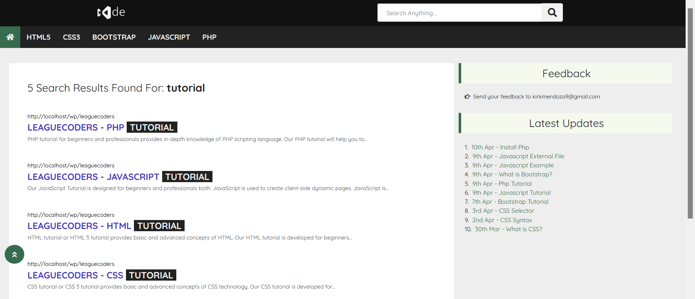
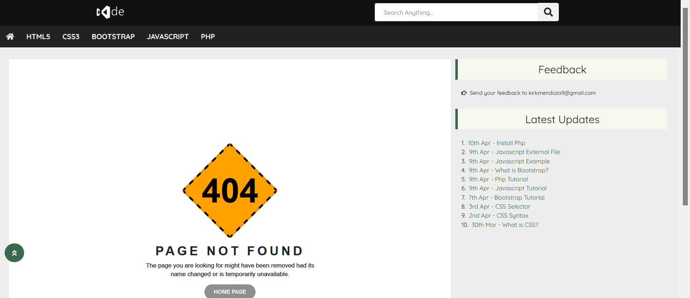

# Wordpress Theme

This is a simple Wordpress Theme to learn programming lesson in a nutshell

## Demo Picture Only
&nbsp;&nbsp;&nbsp;&nbsp;

## Getting Started

These instructions will get you a copy of the project up and running on your local machine for development and testing purposes.

### Prerequisites

What things you need to install the system

```
PHP 5.3.7 and higher
MySQL 8.0+
```

### Installing

A step by step series of examples that tell you how to get a development env running

Say what the step will be
```
Clone or download the repository.
```
and
```
Setup the database and create your own wordpress database
```

## Built With

* [PHP](https://www.php.net/) - Backend Language used
* [Wordpress](https://wordpress.com/) - CMS used
* [Jquery](https://jquery.com/) - JS library used
* [Bootstrap](https://bootstrap.com/) - Css Framework used
* [Fontawesome](https://fontawesome.com/) - Icons use

## License

This project is licensed under the MIT License - see the [LICENSE](https://opensource.org/license/mit/) website for details

## Get in touch with me

Twitter - [@hi_im_kirk](https://twitter.com/hi_im_kirk) <br>
Facebook - Message me on my facebook account [Kirk Anthony Mendoza](https://www.facebook.com/mickey014/) <br>
Email - You can just email me for system just message me in kirkmendoza9@gmail.com <br>
Contact# - Leave a message on 0930-980-0034

Project Link: [https://github.com/mickey014/leaguecoders](https://github.com/mickey014/leaguecoders)

